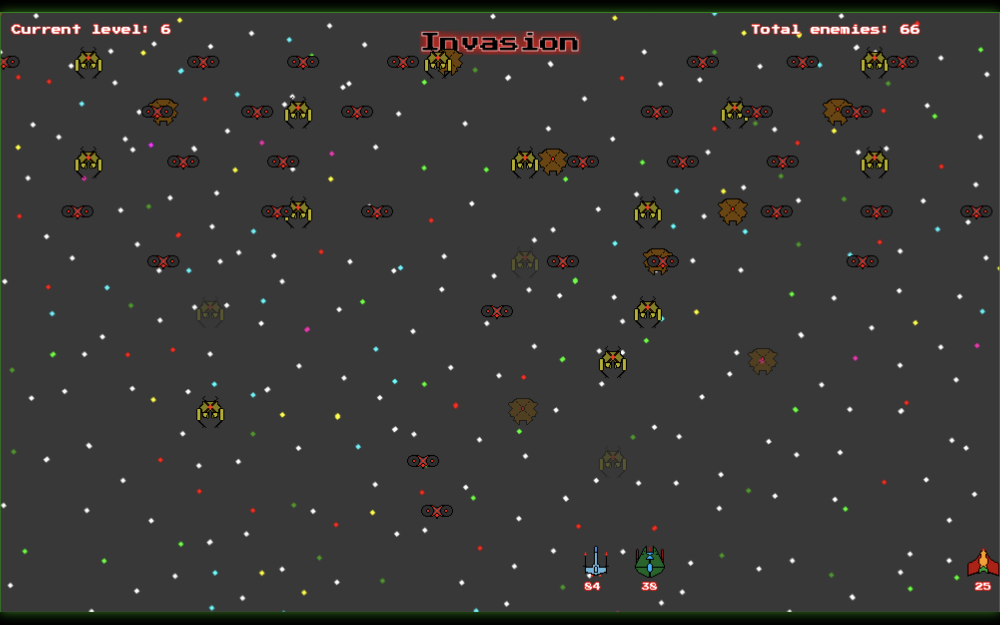

# Fire Cosmos

Fire Cosmos is an open source game in which you need defend the Earth from an alien invasion!! YOU NEED TO SAVE THE EARTH!

You can play from 1 to 4 players simultaneously;

Game in Portuguese and English;

- [Play Fire Cosmos](https://mangito.github.io/FireCosmos/);
- [Play In Itch.io](https://mangito.itch.io/fire-cosmos);
- [Mangito WebSite](https://mangito.github.io/);

## Some screenshots
### Home

In the home menu, here you can choose what to do, like the game mode, change something in the settings, etc.

### Invasion

In Invasion mode you and your friends must defend the Earth from immense aliens.

### TeamDeathmatch

In TeamDeathmatch mode you can face your friends in the future of Earth, whoever makes the first 5 wins.

[Versão portuguesa](./README/Portugues.md);
