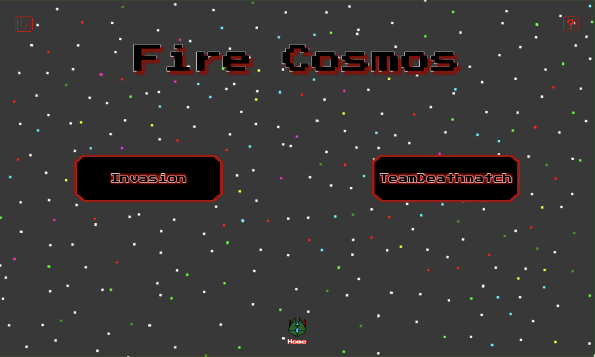

# Fire Cosmos

Fire Cosmos é um jogo de código aberto no qual tu precisas defender a Terra de uma invasão alienígena!! TU TENS DE SALVAR A TERRA!

Podes jogar de 1 a 4 jogadores simultaneamente;

Jogo em português e inglês;

- [Jogar Fire Cosmos](https://mangito.github.io/FireCosmos/);
- [Jogar na Itch.io](https://mangito.itch.io/fire-cosmos);
- [Mangito WebSite](https://mangito.github.io/);

## Algumas screenshots

### Home

No menu inicial, aqui podes escolher o que fazer, como o modo de jogo, mudar algo nas definições, etc..

### Invasion

No modo Invasion tu e os teus amigos tem de defender a Terra de imensos alienígenas.

### TeamDeathmatch

No modo TeamDeathmatch podes enfrentar os teus amigos no futuro da Terra, quem fizer primeiro 5 vence.

